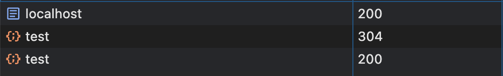

# Chrome DevTools 304 Bug

Run

```sh
./server.js
```

Load http://localhost:8000

After the first page load, the Chrome DevTools shows that
http://localhost:8000/test has a 304 response and
http://localhost:8001/test has a 200 response.

In reality, they both have 304 responses.


